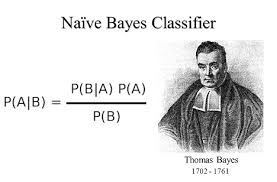
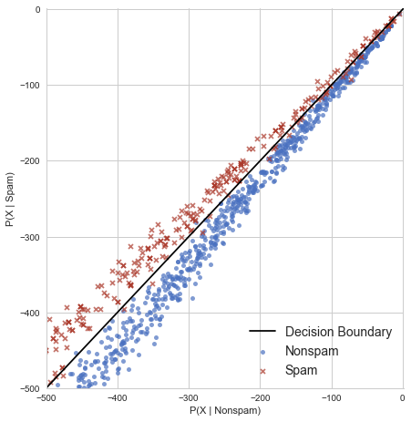
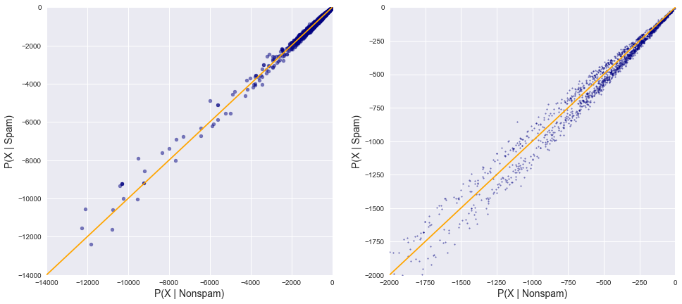
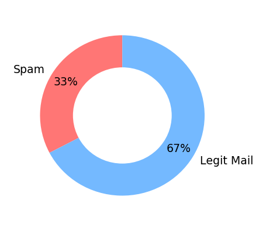
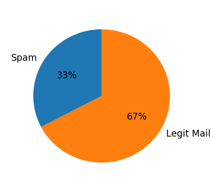
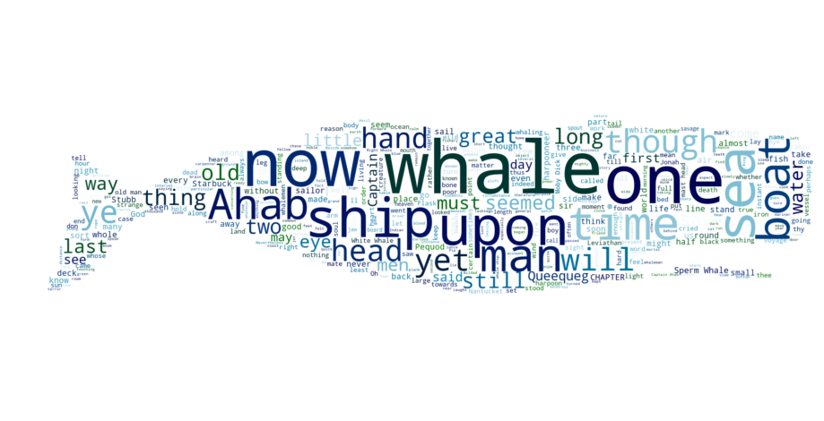
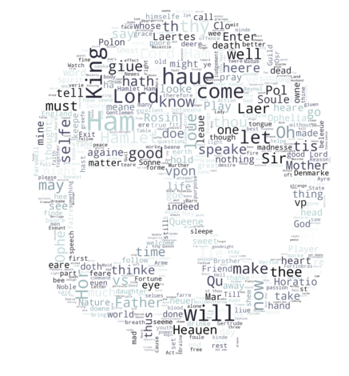
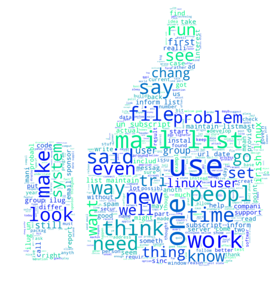

# Bayes Classifier : Project Overview

* Build a home valuation tool
   

## Business Problem
  
  
  People who want to value of home in Bosten area by their requirements.

## Gather Data
  Get details about [Boston Dataset](https://scikit-learn.org/stable/modules/generated/sklearn.datasets.load_boston.html)
   
## EDA
   
   
   
   
   
   
   
   
   
## Model
